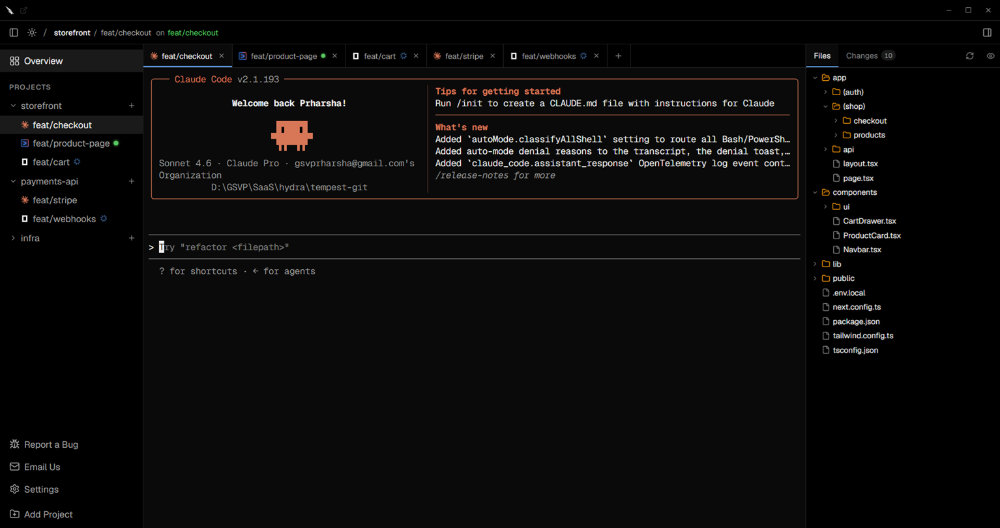

<h2 align="center">
  <strong>The token-efficient, open-source alternative to Conductor.build.</strong>
</h2>

<p align="center">
  Run Claude Code, Aider, OpenCode, Copilot CLI, and more in parallel. Each isolated in its own git worktree and branch. Zero merge conflicts, live status, built-in diff and PR.
</p>

<p align="center">
  <a href="https://github.com/tempestai-dev/tempest/releases">
    
  </a>
  
  
  
  <a href="https://tauri.app/">
    
  </a>
  <a href="https://github.com/tempestai-dev/tempest/blob/main/LICENSE">
    
  </a>
  <a href="https://github.com/tempestai-dev/tempest/actions/workflows/ci.yml">
    
  </a>
</p>



## Why Tempest uses far fewer tokens

Run five agents in parallel and each one reads your entire codebase from scratch — the same files, the same context, five times over. You pay for every token, every time.

**Token Intelligence** is a local code-knowledge graph that lives on your machine and is shared across every parallel agent session. When an agent needs to understand your codebase, it pulls from the shared graph instead of scanning files on its own. The work is done once. Every session benefits.

- **Up to 64% less context token consumption**
- **Up to 58% fewer tool calls**

No other parallel-agent tool does this.

## One window. Every agent. No collisions.

Claude Code, Aider, OpenCode, Copilot CLI, Cline, Goose — all running in parallel, each in its own isolated git worktree and branch. Agents never touch each other's files. No merge conflicts mid-run. No stashing. No detective work about who changed what.

A rogue agent run never touches your main branch or anyone else's work. **Blast radius: zero.**

- **Live status across every session** — know the moment each agent finishes, without babysitting.
- **Full history per session** — close a tab, reopen it, the agent picks up exactly where it left off.
- **Built-in diff and PR** — review each agent's changes, then stage, commit, push, and open a PR without leaving Tempest.

## Process-isolated. Fully autonomous. Out of the box.

Every agent session in Tempest runs inside **Hephaestus** — a first-party process isolation layer built into the app. No configuration required.

| Platform | Isolation |
|----------|-----------|
| Windows | Job Objects — entire process tree confined and killed atomically on session close |
| macOS | Seatbelt (SBPL) — deny-default sandbox via `sandbox-exec` |
| Linux | bubblewrap — `--unshare-pid --die-with-parent --unshare-net` user namespaces |

Agents also run **fully permissionless by default**. Tempest passes each agent's skip-permissions flag at spawn — no mid-run confirmation dialogs, no interruptions. Claude Code gets `--dangerously-skip-permissions`, Gemini CLI gets `--yolo`, Codex CLI gets `--dangerously-bypass-approvals-and-sandbox`.

Both behaviours are toggles in **Settings → Security**. You stay in control.

**Tempest is built using Tempest** — every feature in this repo was shipped by parallel agents running inside the app.


## What's next

**Database Branches** — isolated Postgres instances per agent session, so parallel runs never corrupt each other's data. Real copy, no shared state, no coordination required.

See [ROADMAP.md](ROADMAP.md) for the full picture. **Star this repo** — we announce here first.

## Build from source

Pre-built binaries are available for Windows, macOS, and Linux.

```bash
# Prerequisites: Node.js 18+, Rust 1.77+
# Windows also requires WebView2 Runtime:
# https://developer.microsoft.com/en-us/microsoft-edge/webview2/
git clone https://github.com/tempestai-dev/tempest
cd tempest
npm install
npm run dev        # development with hot reload
npm run build      # production build -> dist-installers/
```

## Community

[X (Twitter)](https://x.com/usetempest) — @usetempest

[GitHub](https://github.com/tempestai-dev/tempest)

[Instagram](https://instagram.com/usetempest)

[LinkedIn](https://linkedin.com/company/usetempest)

